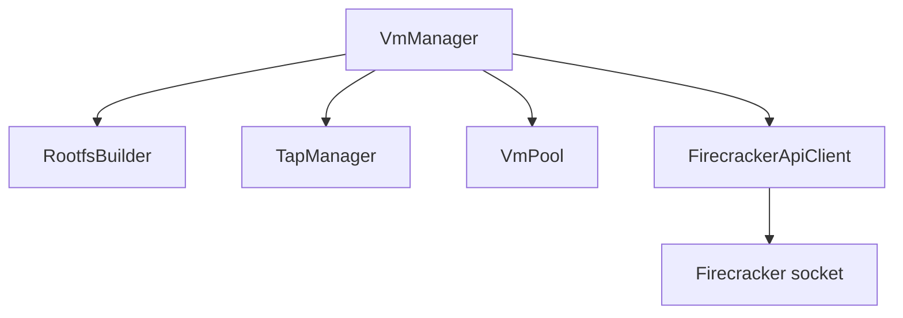

# Firecracker Module Documentation

The `firecracker` module provides high-performance lightweight microVM management for Devion. It encapsulates the interaction with the Firecracker VMM, managing the VM lifecycle, networking (TAP devices), storage (ext4 rootfs built from Docker images), and a JSON-over-socket client wrapper.

## Table of Contents

- [Key Architecture & Components](#key-architecture--components)
- [Configuration](#configuration)
- [VM Lifecycle Flow](#vm-lifecycle-flow)
- [API Reference](#api-reference)
  - [VmManager](#vmmanager)
  - [FirecrackerApiClient](#firecrackerapiclient)
  - [RootfsBuilder](#rootfsbuilder)
  - [TapManager](#tapmanager)
  - [VmPool](#vmpool)

---

## Key Architecture & Components

The module is structured as follows:

- **[`VmManager`](../src/vm/vm-manager.ts)**: Orchestrates the overall lifecycle. It leverages the other components to spin up, configure, pause, resume, and terminate microVMs.
- **[`FirecrackerApiClient`](../src/client/firecracker-api.ts)**: A client library implementing JSON-over-UDS HTTP requests to configure and interact with the Firecracker daemon API.
- **[`RootfsBuilder`](../src/image/rootfs-builder.ts)**: Pulls Docker images, exports their filesystems, and builds formatted ext4 loop files for the VM's root block device.
- **[`TapManager`](../src/network/tap-manager.ts)**: Interacts with the Linux system to create and configure TAP network devices bridged to the host network interface.
- **[`VmPool`](../src/vm/vm-pool.ts)**: In-memory registry keeping track of active and managed VM instances.

---

## Configuration

Configuration is defined in [`src/config.ts`](../src/config.ts) and parsed using Zod via `@repo/core`. The following environment variables are supported:

| Environment Variable | Description | Default Value |
|----------------------|-------------|---------------|
| `FIRECRACKER_SOCKET_DIR` | Directory where Firecracker UDS sockets are stored | `/run/devion/firecracker` |
| `FIRECRACKER_KERNEL_PATH` | Path to the uncompressed Linux kernel image (`vmlinux`) | `/opt/devion/vmlinux` |
| `FIRECRACKER_BINARY_PATH` | Path to the `firecracker` executable | `/usr/bin/firecracker` |
| `FIRECRACKER_DEFAULT_VCPUS` | Default number of vCPUs per VM | `1` |
| `FIRECRACKER_DEFAULT_MEMORY_MIB` | Default RAM memory size in MiB | `256` |
| `FIRECRACKER_ROOTFS_DIR` | Directory containing VM ext4 disk images | `/var/devion/rootfs` |
| `FIRECRACKER_TAP_BRIDGE` | Bridge interface to join TAP devices to | `virbr0` |
| `FIRECRACKER_SUBNET` | Subnet allocated for microVMs | `172.20.0.0/16` |

---

## VM Lifecycle Flow

When [`createVm`](../src/vm/vm-manager.ts) is called, the following steps execute sequentially:

1. **Allocate Subnet and MAC**: Generates a random MAC address and assigns an IP address from `FIRECRACKER_SUBNET`.
2. **Build Rootfs**: Pulls the Docker image ref, exports the filesystem to a temporary folder, creates an empty loop file, formats it with `ext4`, mounts it, copies files, and unmounts.
3. **Setup TAP Network**: Adds a Linux TAP interface via `ip tuntap` and links it to `FIRECRACKER_TAP_BRIDGE`.
4. **Spawn VMM Process**: Spawns a background process running the `firecracker` binary listening on the UDS socket.
5. **Configure & Boot VMM**:
    - Sets CPU & memory limits.
    - Sets boot arguments (`console=ttyS0 ip=...`).
    - Mounts the `rootfs` ext4 file as the root drive.
    - Attaches the network interface.
    - Sends the `InstanceStart` command.

---

## API Reference

### VmManager

Located in [`src/vm/vm-manager.ts`](../src/vm/vm-manager.ts).

- `createVm(options: CreateVmOptions): Promise<VmInstance>`
  Deploys and starts a new microVM.
- `stopVm(vmId: string): Promise<void>`
  Kills the underlying Firecracker OS process using `SIGTERM`.
- `pauseVm(vmId: string): Promise<void>`
  Pauses VM execution via the Firecracker snapshot API.
- `resumeVm(vmId: string): Promise<void>`
  Resumes VM execution.
- `deleteVm(vmId: string): Promise<void>`
  Stops the VM, tears down TAP networking, deletes socket/rootfs files, and removes it from the pool.
- `getVm(vmId: string): Promise<VmInstance | null>`
  Retrieves a VM from the local pool.
- `listVms(): Promise<VmInstance[]>`
  Returns all registered VMs.

### FirecrackerApiClient

Located in [`src/client/firecracker-api.ts`](../src/client/firecracker-api.ts).

Communicates with the local Firecracker socket. Key endpoints:
- `/machine-config` (`PUT`) - Sets CPU / RAM resources.
- `/boot-source` (`PUT`) - Sets kernel & boot options.
- `/drives/<id>` (`PUT`) - Adds root/secondary disk drives.
- `/network-interfaces/<id>` (`PUT`) - Adds host-backed network interfaces.
- `/actions` (`PUT`) - Starts the instance.
- `/vm` (`PATCH`) - Pauses/Resumes VM.
- `/snapshot/create` / `/snapshot/load` (`PUT`) - Manages snapshots.

### RootfsBuilder

Located in [`src/image/rootfs-builder.ts`](../src/image/rootfs-builder.ts).

- `buildRootfs(imageRef: string, outputPath: string): Promise<string>`
  Spawns `docker`, `tar`, `dd`, `mkfs.ext4`, and `mount` commands to build a boots-ready ext4 root filesystem from any Docker image.

### TapManager

Located in [`src/network/tap-manager.ts`](../src/network/tap-manager.ts).

- `createTap(tapName: string, bridgeName?: string): Promise<void>`
- `deleteTap(tapName: string): Promise<void>`
- `tapExists(tapName: string): Promise<boolean>`
- `listTaps(): Promise<string[]>`

### VmPool

Located in [`src/vm/vm-pool.ts`](../src/vm/vm-pool.ts).

- `add(vm: VmInstance): void`
- `get(vmId: string): VmInstance | undefined`
- `update(vmId: string, updates: Partial<VmInstance>): void`
- `remove(vmId: string): void`
- `list(): VmInstance[]`
- `getByStatus(status: VmStatus): VmInstance[]`
